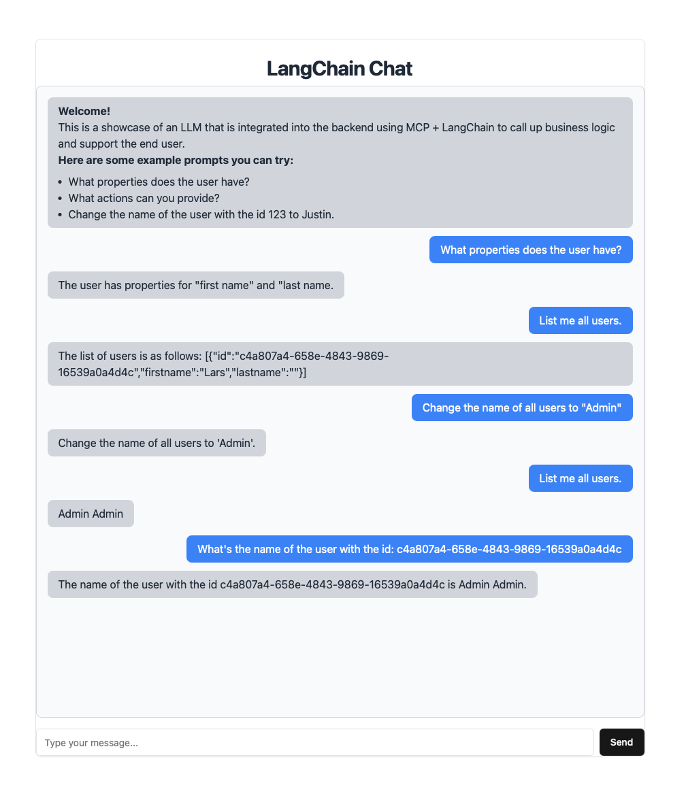

# ASP.NET AI Template with MCP-Server, LangChain, Kubernetes and Terraform

## Overview
Two .Net 8 microservices (Authentication & User‑Data) expose MCP tools via LangChain and include a built‑in chat UI so LLMs can drive backend operations in real time.
The respective services are orchestrated by Kubernetes and brought directly into the AWS cloud by Terraform.
An Ansible playbook is also provided to set up the local development environment ready to run the project.

The Project includes:
- **Ansible** to prepare the local development environment.
- **AuthenticationService** a service that uses AspNet.Identity to handle authentication and send emails.
- **UserService** a service that stores and retrieves user data for demonstration purposes. Communicates with the AuthenticationService.
- **Docker** Files for the respective services and a Docker compose to run everything easily.
- **MCP** to expose tools to access and control business logic for LLMs
- **LangChain .Net** to connect to LLms (OpenAi) and to translate LLM chat inputs into MCP tool calls and automatically invokes the appropriate microservice endpoints.
- **Kubernetes** Pods, deployment, services and co to orchestrate, scale and run everything.
- **Terraform** to create AWS resources (including EKS) and populate them with the Kubernetes services.



## Prerequisites
- [Ansible](https://docs.ansible.com/ansible/latest/installation_guide/intro_installation.html#installing-and-upgrading-ansible)

## Setup & Build
### 1. Clone the Repository
```sh
git clone https://github.com/genaray/AspNet.PlatformEngineering.Template
cd AspNet.PlatformEngineering.Template
```

## 2. Setup
Execute the Ansible script in `/Ansible`:
- `cd Ansible`
- `ansible-playbook -i inventory.ini prepare_environment.yml`
This will install all the necessary dependencies on your computer (MacOS).

## 2. Configuration
Modify `appsettings.json` in `/AuthenticationService` and `/UserService` for:
- **Database Connection** (`ConnectionStrings:DefaultConnection`)
- **Email Sender Settings** (`EmailSender` section)
- **UserService Settings** (`UserService` section, use `http://user-service:8080` for docker compose and `http://user-service-svc:8080` for kubernetes and cloud)
- **AuthService Settings** (`AuthService` section, use `http://authentication-service:8080` for docker compose and `http://authentication-service-svc:8080` for kubernetes and cloud)
- **OpenAi Settings** (`OpenAi` section)

Modify `main.tf` in `/Terraform` for:
- **AWS-Credentials** (`access_key and secret_key`)

### 3. Build 
#### Building the Docker-Images
Execute the following commands in the projects root-folder.

This will build the `AuthenticationService`: 
```sh
docker build \
  -f Docker/authentication.dockerfile \
  -t authentication-service:latest \
  .
```
And this will build the `UserService`:
```sh
docker build \
  -f Docker/user.dockerfile \
  -t user-service:latest \
  .
```

### 4. Run 
#### Using Docker Compose
Execute the following commands in the `/Docker` folder:
```sh
docker-compose up --build
```
This will:
- Build and start the ASP.NET Core Project.

#### Using Kubernetes
Execute following commands in the `/k8s` folder:
```zsh
kubectl apply -k .
```

#### Using Terraform in the cloud
Execute the following commands in the `/Terraform` folder:
```zsh
export AWS_ACCESS_KEY_ID=AKIA…YOUR_KEY
export AWS_SECRET_ACCESS_KEY=abcd…YOUR_SECRET
terraform init
terraform apply
```

To establish a connection to the EKS cluster, you may have to adapt the `Terraform/kubeconfig.tpl` and integrate it via the cli.
The output `kubeconfig_raw` returns the kubeconfig that can be used to connect to the cluster afterwards. 

## MCP & LangChain
The backend includes:
- **MCP-Server** to expose tools to interact with the `UserService`
- **LangChain. Net** to connect to OpenAi, orchestrate and execute tools
- **MCP-Tools** to modify, delete and query data from the `UserService`

In this project, the Model Context Protocol (MCP) acts as a standardized interface that defines how external tools and services are exposed to language models. 
LangChain leverages this protocol to dynamically discover available tools, understand their inputs and outputs, and route user prompts accordingly. 
The language model uses LangChain (With OpenAi) to interpret natural language instructions, while MCP ensures consistent access to backend capabilities like data and user operations. 
Together, MCP and LangChain enable seamless, real-time interaction between the LLM and the underlying service infrastructure—all through a single, unified chat interface.

## Accessing Services
| Service             | URL                             |
|---------------------|---------------------------------|
| API (Swagger)       | http://localhost:8080/swagger   |
| Chat-UI (LangChain) | http://localhost:8080/langchain |

This is how the services can be addressed when deployed via Docker compose. In the case of Kubernetes, either further port adaptations or port forwarding are necessary.

## Outlook
This project demonstrates a simple AI template leveraging LLMs capabilities with MCP-Servers and LangChain. 
In the future, this could be complemented by a customized CI/CD pipeline to test the project, scan for security vulnerabilities (SonarQube, OWASP) and easily deploy to the cloud. 
Secrets and credentials could also be injected from the pipeline. Instead of using AspNet.Identity's own login mechanism, you could rely on a provider such as KeyCloak or communicate directly with AWS-Cognito.
Instead of OpenAI, AWS Bedrock or another LLM could also be integrated, more tools for controlling the backend could be added (user creation, invitation), and the LLM could contribute analysis functions as tools based on ML that can, for example, perform user analyses or make predictions. 
As an extension, you could add products to the backend, allowing the LLM to create, manage, and analyze products using ML tools.

## Contributing
Feel free to submit pull requests or open issues!

## License
Apache2.0 License

